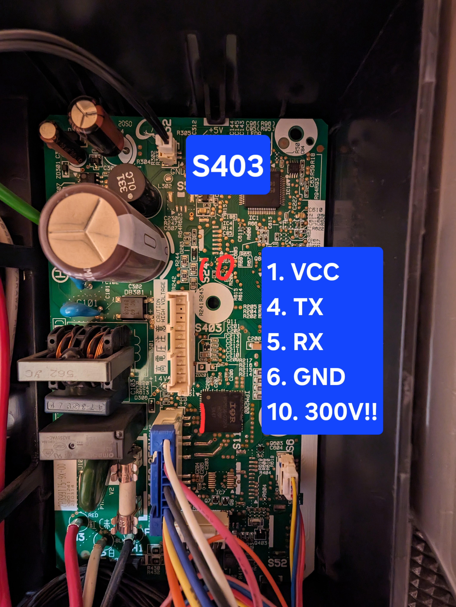
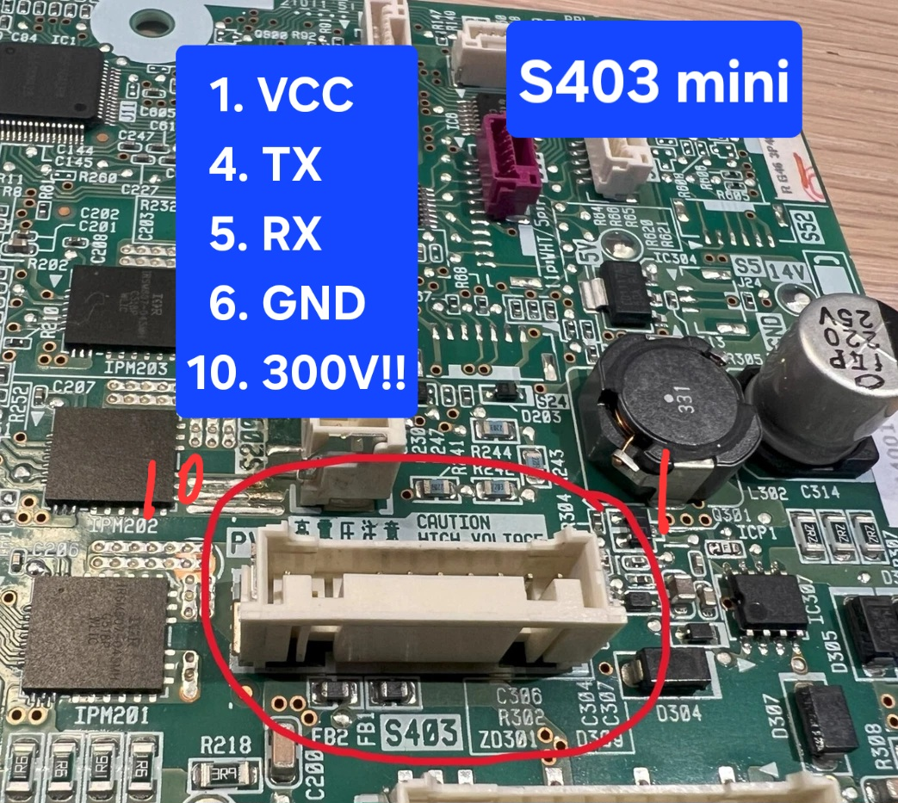
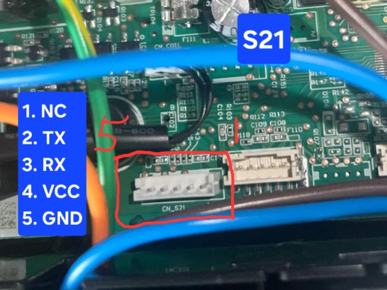
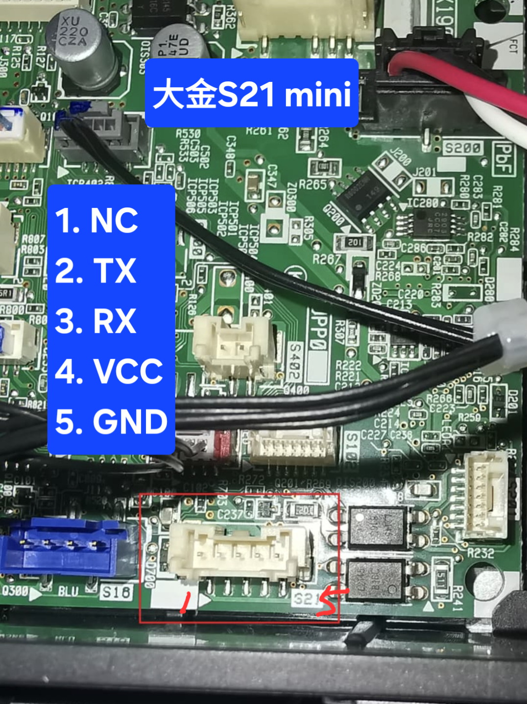

# Daikin-ESPhome

這是個使用ESP32C3搭配ESPhome來控制大金空調的專案，可適用壁掛及吊隱式冷氣

大金空調常見有四種接頭，此專案分享台灣型號與接頭對照表與腳位定義，供想DIY的人使用

歡迎發issue回報型號與接頭形式

## 硬體架構

### 硬體需求

1. ESP32C3 super mini
2. 5V to 3.3V level shifter (推薦使用)
3. DCDC to 5V

由於VCC電壓會>5V，所以一定要用DCDC降壓成5V再供給ESP32C3

範例YAML中的腳位定義如下:

| Pin name | ESP32C3 |
|:--:|:--:|
| GND | GND |
| TX | GPIO7 |
| RX | GPIO6 |
| VCC | DCDC模組input |
| DCDC模組output | 5V |

腳位定義與順序請參考下面資料

### 接頭形式與型號系列對照表:

| 系列 | 型號 | 型態 | 接頭 | 備註 |
|:--:|:--:|:--:|:--:|:--:|
| 橫綱Y | FTXM**YVLT | 壁掛 | ? | - |
| 橫綱X | FTXM**XVLT | 壁掛 | ? | - |
| 橫綱V | FTXM**VVLT | 壁掛 | S21 mini | - |
| 橫綱Z | FTXM**ZVLT | 壁掛 | S21 mini | VCC在Pin1! |
| 大關SA | FTXV**SAVLT | 壁掛 | S403 | - |
| 大關Z | FTXV41/50/60/71ZVLT | 壁掛 | S403 mini | - |
| 大關U | FTXV22/28/36UVLT | 壁掛 | S403  | - |
| 大關U | FTXV41/50/60/71UVLT | 壁掛 | S403 mini  | - |
| 經典V | FTHF**VAVLT | 壁掛 | S403 | - |
| 一對二 | CTXP**TVLT | 壁掛 | S403 | - |
| 橫綱R(一對多) | FTXM**RVLT | 壁掛 | S21 | - |
| 橫綱N | FTXM**NVLT | 壁掛 | ? | - |
| 橫綱S | FTXM**SVLT | 壁掛 | ? | - |
| - | FTXS70JVLT | 壁掛 | S21 | - |
| 經典R | FTHF**RAVLT | 壁掛 | S403 mini | - |
| 吊隱R | FDXV**RVLT | 吊隱 | S21 | - |
| 商用VRV | CDXS**DVMT | 吊隱 | S21 | - |

### 台灣型號常見有以下四種接頭形式:

## S403接頭

接頭規格: JST XAP-10V-1

間距: 2.5mm

針數: 10Pins

備註: Pin10有超高電壓請務必確認順序及斷電再安裝!!

---

## S403 mini接頭

規格: JST PBVP-10V-S

間距: 2.0mm

針數: 10Pins

備註: Pin10有超高電壓請務必確認順序及斷電再安裝!!

---

## S21 接頭

規格: EH-5Y (等同EH-2.5mm)

間距: 2.5mm

針數: 5Pins

## S21 mini接頭

規格: JST PAP-5 (等同PA-2.0mm-5P)

間距: 2.0mm

針數: 5Pins

備註: **有些型號VCC是來自Pin1，目前已知橫綱Z系列是在Pin1**

## Credit & Thanks

- Wiring references: [https://github.com/revk/ESP32-Faikin/wiki/Wiring](https://github.com/revk/ESP32-Faikin/wiki/Wiring)
- ESPhome component: [https://github.com/asund/esphome-daikin-s21](https://github.com/asund/esphome-daikin-s21)
- 台灣大金適用無線控制型號列表: [台灣官網](https://www.hotaidev.com.tw/web/product/9/59.html)

